# Secure Certificate, Job Experience & Recommendation Verification System
Secure Certificate, Job Experience & Recommendation Verification System

Secure Digital Credential & Professional Experience Verification Platform

Confidentiality Notice : 
This project was developed for a confidential institutional environment.

This repository contains a sanitized technical representation of the system for portfolio and professional demonstration purposes. Confidential institutional information, production infrastructure, credentials, personal information, internal endpoints, database records, and sensitive implementation details have intentionally been excluded.

1. Overview

The Certificate, Job Experience & Recommendation Verification System is a full-stack web application built with Node.js, Express.js, and MySQL. It provides controlled workflows for issuing, managing, and publicly verifying three types of professional credentials

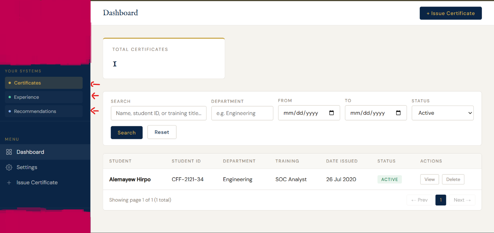

Training Certificates — issued with a UUID-based cert ID, a QR code pointing to a public verification URL, and an optional PDF/image document upload.
Job Experience Records— issued by HR admins, each with a unique exp ID and a verifiable document attachment.
Recommendation Records — managed by authorized recommendation admins, verifiable via a unique rec ID.

Because these records can serve as evidence of education, employment, and professional qualifications, integrity, authenticity, access control, and auditability are foundational requirements of the system.

2. System Architecture

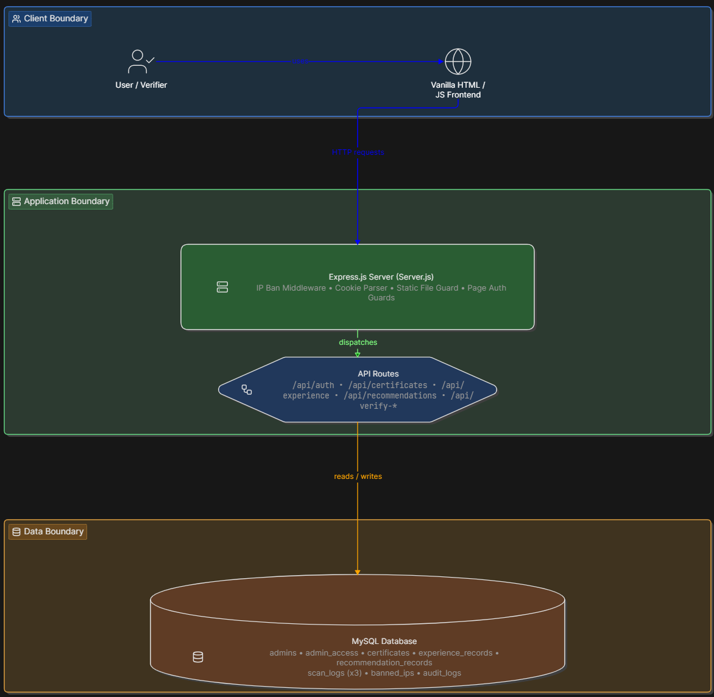

3. Project Structure

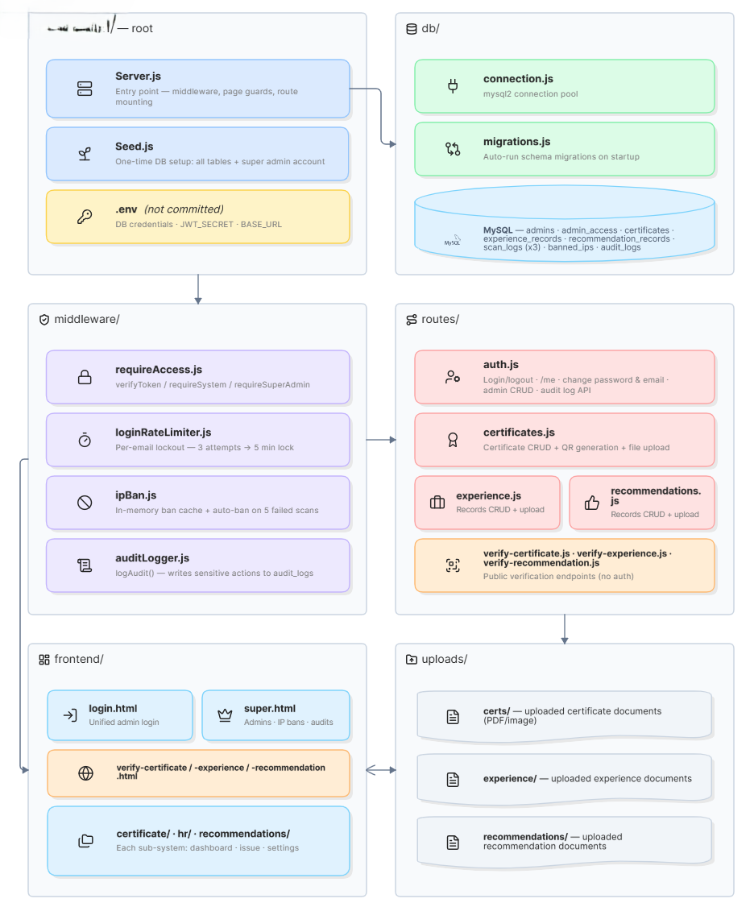

4. Admin Role Architecture

The system uses a two-tier RBAC model backed by two database tables:

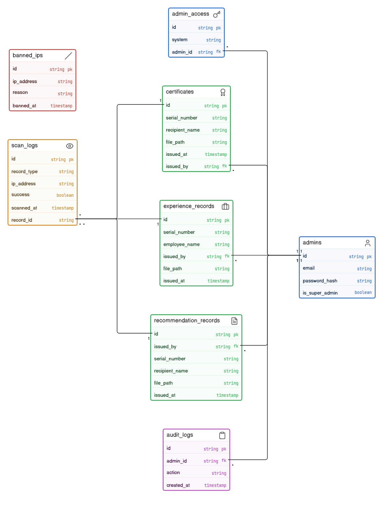

Super Admin
- Created once via ‘Seed.js’ no additional super admins can be created
- Accesses the Super Admin Console (‘/super’) to manage all other admins
- Grants or revokes sub-system access per admin
- Views unified scan logs across all three sub-systems
- Manages IP bans and views full audit logs
- Cannot operate inside any sub-system (enforced in ‘requireSystem()’)

Sub-system Admins
Each admin can hold access to any combination of the three systems:

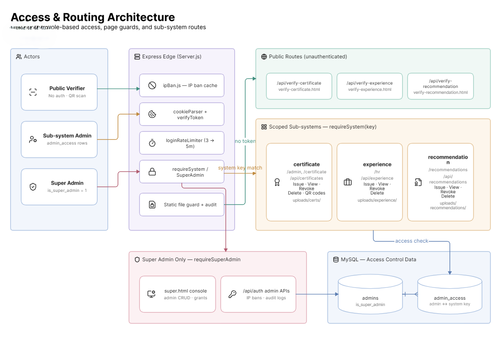

5. Authentication & Session Security

Authentication is handled by ‘routes/auth.js’ and the ‘requireAccess.js’ middleware.
 Login Flow
 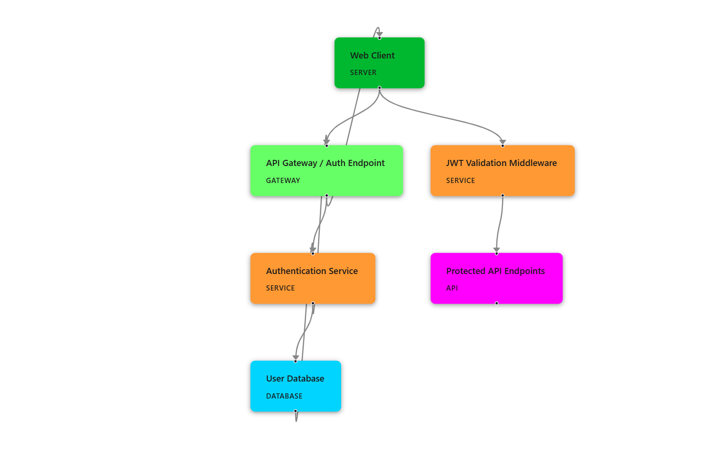
 
 6. Security Controls
6.1 Brute-Force Protection (‘middleware/loginRateLimiter.js’)
- Tracks failed login attempts per email in an in-memory ‘Map’
- After 3 failed attempts, the account is locked for 5 minutes
- Lockout response: ‘HTTP 429’ with ‘retryAfterMs’ and ‘retryAfterSec’ fields
- Successful login clears the counter via ‘resetAttempts(email)’
 .png)

 .png)
6.2 IP Banning (‘middleware/ipBan.js’)
- Banned IPs are loaded from the ‘banned_ips’ MySQL table into an in-memory ‘Set’ on startup
- ‘ipBanMiddleware’ runs globally before all routes — banned IPs receive ‘HTTP 403’ immediately
- Auto-ban: if an IP accumulates 5 or more failed verification scans (across all three sub-systems) within 10 minutes, it is automatically inserted into ‘banned_ips’ and the in-memory set is updated without restart
- Super admins can manually ban/unban IPs via the console (‘POST /api/auth/ban-ip’, ‘/unban-ip’)
- 
 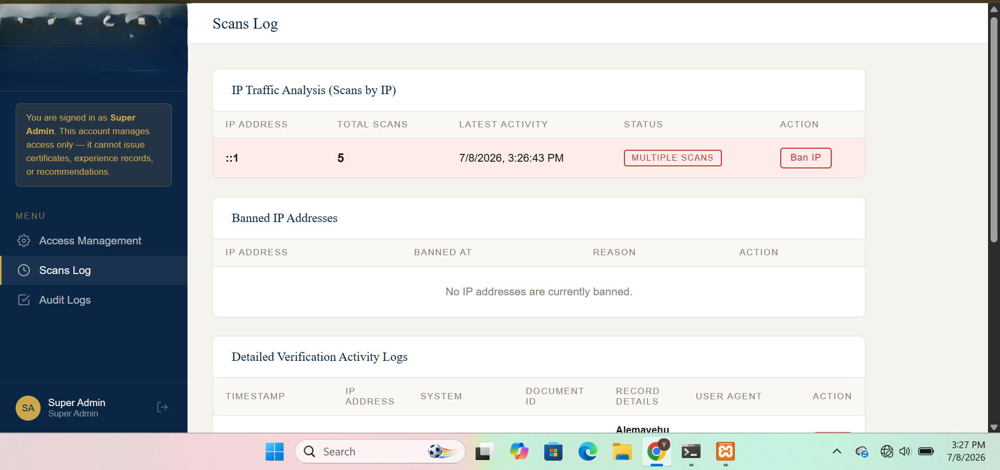

6.3 Audit Logging (‘middleware/auditLogger.js’)
Every sensitive action calls ‘logAudit(req, action, details)’, which writes a row to the ‘audit_logs’ table:

 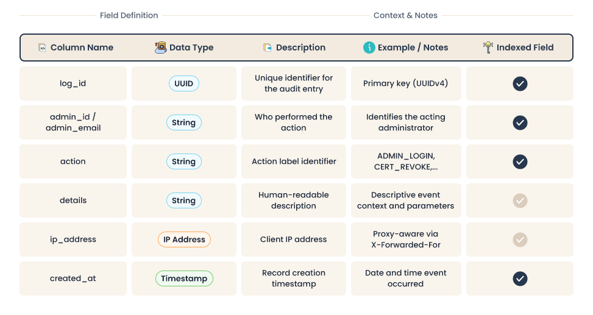

  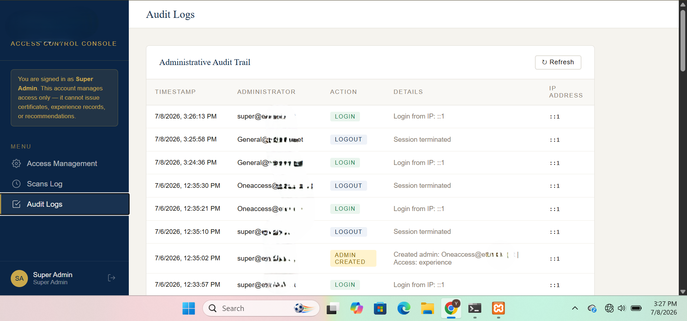

6.4 Secure File Serving
Uploaded documents are not served as raw static files. Every request to ‘/uploads/:system/:filename’ is intercepted:
- The DB is queried to confirm the record exists and its ‘status’ is not `’revoked’`
- Revoked documents return ‘HTTP 403’; missing records return ‘HTTP 404’
- Files are served with ‘res.sendFile()’ using a normalized path to prevent directory traversal

6.5 Password Security
- Passwords hashed with bcrypt.
- Minimum 8 characters enforced at both creation and change endpoints
- Current password must be confirmed before changing password or email (‘PATCH /api/auth/change-password’, ‘/change-email’)

6.6 Input Validation
- Required fields are checked before any DB write
- File uploads restricted to PDF and image MIME types only (enforced in multer ‘fileFilter’)
- File size capped at 10 MB per upload
- System names validated against an allowlist: ‘[‘certificate’, ‘experience’, ‘recommendation’]’

7. Core Modules

Certificate Sub-system (‘routes/certificates.js’)
- Issue: ‘POST /api/certificates’ — stores cert metadata, uploads document, generates a QR code (via ‘qrcode’) pointing to the public verification URL ‘{BASE_URL}/verify-certificate/{cert_id}’
- List / Search: ‘GET /api/certificates’
- View single: ‘GET /api/certificates/:id’
- Revoke / Delete: PATCH/DELETE with audit logging
- Each certificate stores: ‘cert_id’ (UUID), ‘student_name`, `student_id`, `department`, `training_title`, `date_issued`, `issuer_name`, `document_path`, `verify_url`, `qr_code`

Experience Sub-system (`routes/experience.js`)
- Issue, list, view, revoke, delete experience records
- Fields include: `full_name`, `job_title`, `department`, `start_date`, `end_date`, `description`
- Scan log: `experience_scan_logs`

Recommendation Sub-system (`routes/recommendations.js`)
- Issue, list, view, revoke, delete recommendation records
- Fields include: `subject_name`, `purpose`, `recommender_name`
- Scan log: `recommendation_scan_logs`

Public Verification
Three public routes (no authentication required):
- `GET /verify-certificate/:certId` — page queries `GET /api/verify-certificate/:certId`
- `GET /verify-experience/:expId`
- `GET /verify-recommendation/:recId`

Each scan is logged (IP, user-agent, timestamp, document ID or `NULL` for failed lookups). Failed lookups accumulate toward the auto-ban threshold.

8. Database Schema (Key Tables)
 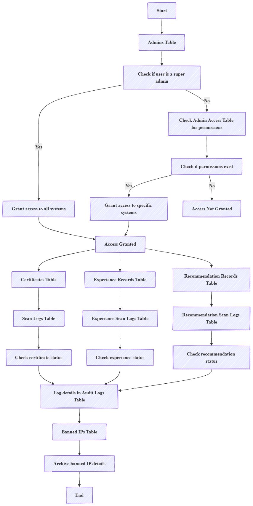

 9. Verification Workflow
 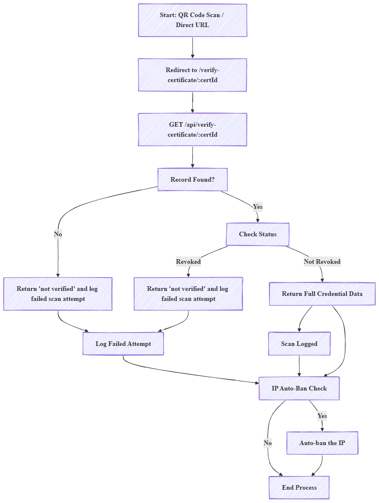

10. Technology Stack

 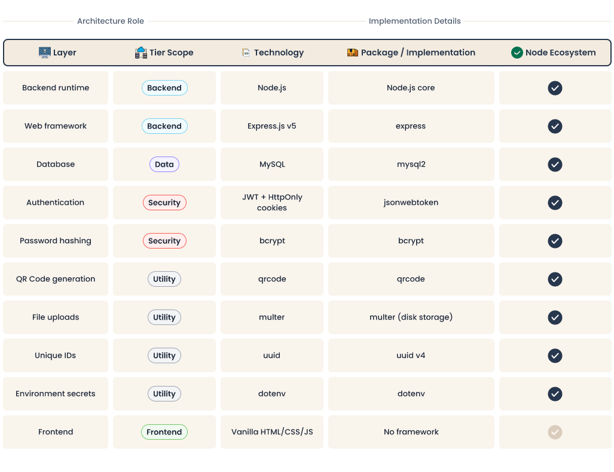

12. Security Threat-to-Control Mapping

 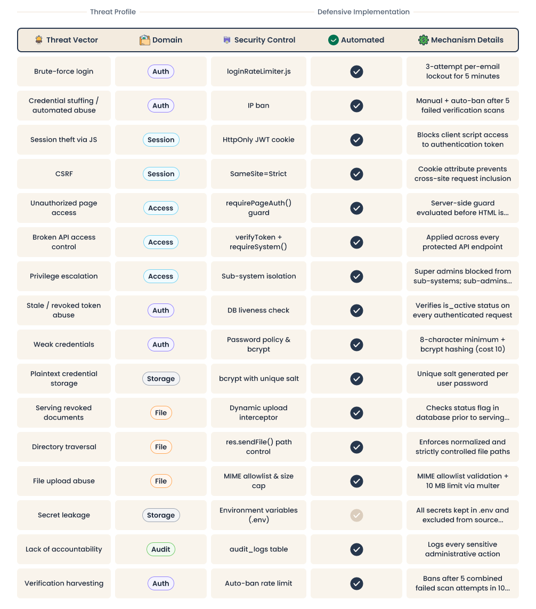

13. Secure Software Development Principles

Defense in Depth — IP banning, rate limiting, JWT cookie auth, server-side page guards, API middleware, and DB-level liveness checks all layer independently. Failure of one control does not compromise the others.

Least Privilege  — Each admin holds only the `admin_access` rows they need. Super admin accounts are explicitly blocked from sub-system operations by design.

Never Trust the Client — Frontend controls (hidden buttons, disabled fields) are never the security boundary. Every API endpoint verifies auth and authorization independently.

Audit Everything — Every login, logout, record creation, revocation, deletion, admin change, IP ban/unban, and access modification is written to `audit_logs`.

Fail Safe— Audit log failures are caught and logged to console but never propagate to break the primary operation.

Secrets Isolation— `JWT_SECRET`, database credentials, and `BASE_URL` live exclusively in `.env` and are loaded via `dotenv`. No secrets appear in application source code.

14. Confidentiality & Data Protection

Due to the confidential nature of the original institutional deployment, this public representation intentionally excludes:

 Real user accounts or credentials
Production certificates, experience records, or recommendations
Production database contents
Internal IP addresses or domain names
Production infrastructure configuration
Confidential organizational details

The repository demonstrates engineering design, security architecture, and implementation quality without disclosing any protected institutional information.

15. Project Contribution

Role: Software Developer & Security Engineer
Key Responsibilities:
Full-stack web application development (Node.js + Express + MySQL + Vanilla JS)
RESTful API design and implementation for three credential sub-systems
JWT-based authentication with HttpOnly cookie session management
RBAC implementation (super admin console + per-system access control)
Brute-force protection (per-email lockout rate limiter)
IP ban system with in-memory cache and automatic abuse detection
Secure file upload pipeline (MIME validation, size limits, revocation-aware serving)
QR code generation for certificate public verification URLs
Audit logging for all sensitive administrative actions
Database schema design and auto-migration on startup
Security-focused testing of authentication, authorization, and verification flows

16. Disclaimer

This repository is a portfolio representation of a confidential institutional project.

No confidential institutional data, production credentials, private infrastructure details, or sensitive operational information is intentionally included.

